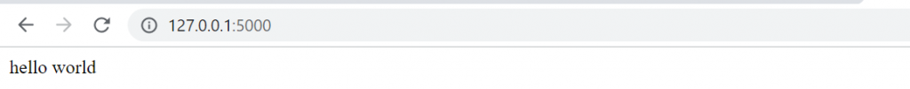
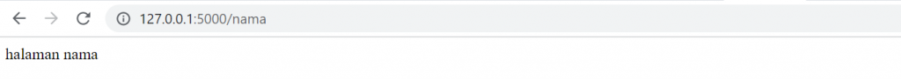
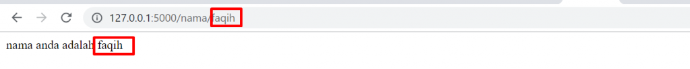
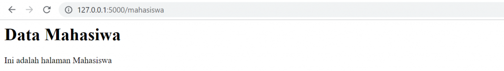
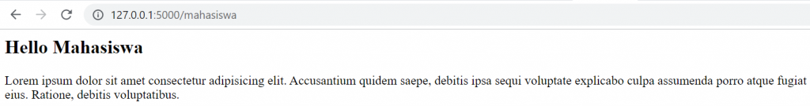
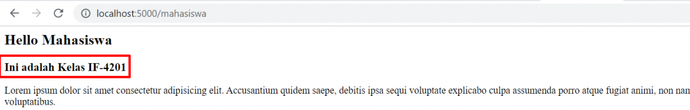
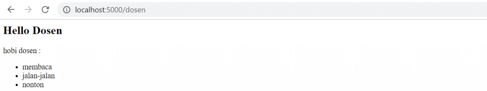

# Flask

Flask adalah micro-framework Python yang digunakan untuk pengembangan aplikasi berbasis web. Flask mudah dan banyak digunakan untuk pengembangan website berbasis Python.

Untuk menggunakan Flask, pastikan Anda melakukan instalasi menggunakan _pip_

```
pip install flask
```

## Flask Hello World
Contoh membuat halaman web sederhana _hello world_ menggunakan Flask.

```python
from flask import Flask

app = Flask(__name__)

@app.route('/')
def index():
    return "hello world"

if __name__ == '__main__':
    app.run(debug=True)
```

Simpan filenya dengan nama `hello.py` dan coba jalankan dengan perintah:

```
python hello.py
```
untuk melihat hasilnya, buka browser dan ketik alamat http://127.0.0.1:5000



## Routing

Setelah kita mengenal cara membuat routing. Kita bisa menambahkan route lainnya dan bisa dipanggil di browser.

Misalnya kita ingin menabah routing `/nama` maka tambahkan kode berikut di bawah `route('/nama')` dan masukkan fungsi yang berbeda dengan route yang sebelumnya

```python
@app.route('/nama')
def nama():
    return "halaman nama"
```

Saat kita memasukkan URL `http://localhost:5000/nama` maka fungsi `nama()` akan dipanggil yang menampilkan string 'halaman nama'



## Routing Dinamis

Kita juga membuat route dinamis berdasarkan input dari user yang dikenal dengan variable-name

Kita tambahkan parameter dengan tipe data tertentu seperti string, integer dan lainnya

Misalnya kita ingin menambah nama yang dinamis maka tambahkan route('/nama/<string:nama>') dengan fungsi `getnama()` yang menggunakan parameter nama

```python
@app.route('/nama/<string:nama>')
def getnama(nama):
    return "nama anda adalah {}".format(nama)
```

Tambahkan nama anda disetelah parameter nama dan jalankan kembali aplikasinya



## Render HTML

Kita bisa memasukkan kode HTML sehingga output lebih menarik

Misalnya kita tambahkan `route('/mahasiswa')` untuk menampilkan judul yang berbentuk Heading

```python
@app.route('/mahasiswa')
def getmahasiswa():
    return '<h1>Data Mahasiwa</h1>'
```



Tentu saja cara seperti kurang cocok jika banyak tag yang ditampilkan

Untuk lebih memudahkan gunakan fungsi `render_template()` yang digunakan untuk render kode HTML

Kita siapkan file HTML misal dengan nama **mahasiswa.html** yang kita simpan di folder templates (harus dengan nama ini)

Stuktur folder adalah sebagai berikut

```
myFlask -- one.py
        -- templates
            -- mahasiswa.html
```
Misalnya kita punya folder utama yang bernama _myFlask_ yang didalamnya terdapat file `hello.py` dan folder templates

Pada file `hello.py` panggil `render_template` terlebih dulu

```python
from flask import Flask, render_template
```

Masukkan kode HMTL berikut ke **templates/mahasiswa.html**

```html
<html>
    <head>
        <title>Halaman Mahasiswa</title>
    </head>
    <body>
        <h2>Welcome Mahasiswa</h2>

        <p>Lorem ipsum dolor sit amet consectetur adipisicing elit. Accusantium quidem saepe, debitis ipsa sequi voluptate explicabo culpa assumenda porro atque fugiat animi, non nam accusamus, expedita eius. Ratione, debitis voluptatibus.</p>
    </body>
</html>
```


modifikasi `route('/mahasiswa')` seperti ini

```python
@app.route('/mahasiswa')
def getmahasiswa():
    return render_template('mahasiswa.html')
```

Refresh browser dan hasilnya akan seperti ini



## Jinja Template

Flask menggunakan template engine yang bernama Jinja2 Template. dengan Jinja2 variabel dan ekspresi yang dituliskan di kode Python dapat ditampilkan juga saat HTML dirender

Misalnya kita ingin menambahkan variabel kelas di `route('/mahasiswa')` dan ditampilkan di kode HTML

Modifikasi `hello.py` di route `mahasiswa`

```python
@app.route('/mahasiswa')
def getmahasiswa():
    kelas = 'IF-4201'
    return render_template('mahasiswa.html', kelas=kelas)
```

Tambahkan tag _Heading 3_ di **mahasiswa.html** serta cetak variabel kelas dengan sintaks `{{ kelas }}`

```html
<html>
    <head>
        <title>Halaman Mahasiswa</title>
    </head>
    <body>
        <h2>Hello Mahasiswa</h2>
        <h3>Ini adalah Kelas {{ kelas }}</h3>

        <p>Lorem ipsum dolor sit amet consectetur adipisicing elit. Accusantium quidem saepe, debitis ipsa sequi voluptate explicabo culpa assumenda porro atque fugiat animi, non nam accusamus, expedita eius. Ratione, debitis voluptatibus.</p>
    </body>
</html>
```

Simpan kode dan reload browser maka akan muncul nama `kelas` yang sudah didefinsikan



Dalam Jinja2 Template ada beberapa beberapa delimiter untuk keluar dari HTML seperti untuk mencetak variabel, menggunakan IF statement dan perulangan

```
 untuk Pernyataan seperti IF dan FOR
{{ ... }} untuk mencetak variabel/ekspresi ke template
{# ... #} untuk Komentar yang tidak disertakan 
```

## FOR dan IF Statement

Kita juga bisa masukkan pernyataan _for_ dan _if_ untuk dirender di HMTL.

berikut adalah contoh untuk menampilkan _list_ tanpa menggunakan _for_

buatlah `route('/dosen')` yang mempunyai hobi `['membaca', 'jalan-jalan', 'nonton']`

```python
@app.route('/dosen')
def getdosen():
    hobi = ['membaca', 'jalan-jalan', 'nonton']
    return render_template('dosen.html', hobi=hobi)
```

buat file dosen.html di folder templates dan masukkan kode ini

```html
<html>
    <head>
        <title>Halaman Dosen</title>
    </head>
    <body>
        <h2>Hello Dosen</h2>

        <p>
            hobi dosen : 
                <ul>
                    <li>{{hobi[0]}}</li>
                    <li>{{hobi[1]}}</li>
                    <li>{{hobi[2]}}</li>
                </ul>
        </p>
    </body>
</html>
```

Hasilnya:



Tapi tentu saja cara ini tidak bagus karena tidak dinamis

Kita bisa gunakan _for_ di Jinja2 Template dengan ``

Ganti kode di tag `<ul></ul>` seperti ini

```html
    <ul>
        
            <li>{{i}}</li>
        
    </ul>
```

## Final Code

Berikut adalah kode lengkap dari file `hello.py`

```python
from flask import Flask, render_template

app = Flask(__name__)

@app.route('/')
def index():
    return "hello world"

@app.route('/nama')
def nama():
    return "halaman nama"

# routing flask dinamis
@app.route('/nama/<string:nama>')
def getnama(nama):
    return "nama anda adalah {}".format(nama)

@app.route('/mahasiswa')
def getmahasiswa():
    kelas = 'IF-4201'
    return render_template('mahasiswa.html', kelas=kelas)

@app.route('/dosen')
def getdosen():
    hobi = ['membaca', 'jalan-jalan', 'nonton']
    return render_template('dosen.html', hobi=hobi)

if __name__ == '__main__':
    app.run(debug=True)
```


Sumber:
- https://ngodingdata.com/tutorial-flask-web-framework-python/