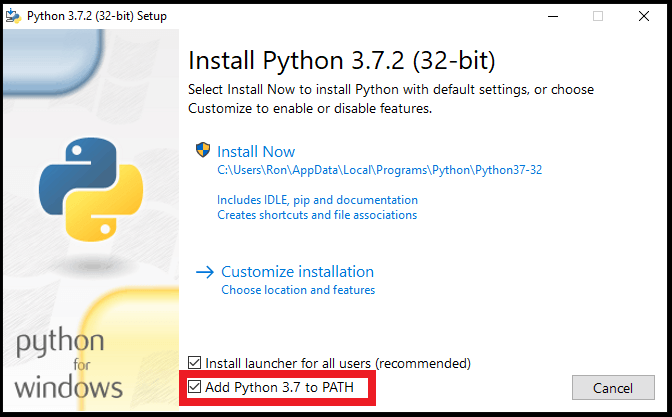

Sebelum Anda menggunakan Python, Anda harus menginstalnya terlebih dahulu di sistem operasi komputer Anda. Saat ini Python memiliki 2 versi yang berbeda, yaitu Python versi **3.8.1** dan Python versi **2.7.10**. Disini kita akan belajar bahasa pemrograman Python menggunakan versi terbaru **3.8.1**.

Cara menginstal python sangat mudah, ikuti panduan dibawah ini. Dibawah adalah panduan cara instal python di platform Linux, Windows dan Mac OS.

# Linux
1. Buka browser, kunjungi [http://www.python.org/downloads/source/](http://www.python.org/downloads/source/)
2. Download versi terbaru Python berbentuk file zip untuk Unix/Linux
3. Ekstrak file zip yang baru saja di download
4. Edit file Modules/Setup jika Anda ingin kostumisasi Python
5. Jalankan `./configure` script
6. `make`
7. `make install`

Langkah ini akan menginstal Python di lokasi standar `/usr/local/bin` dan library di `/usr/local/lib/pythonXX` dimana `XX` adalah versi terbaru Python yang anda gunakan.

> Untuk beberapa distro (distribution store) dari sistem operasi linux sudah terinstal Python di dalamnya. Jadi Anda tidak perlu menginstalnya lagi.

# Windows
1. Download installer di [http://www.python.org/downloads/windows/](http://www.python.org/downloads/windows/) atau lewat _direct link_ [https://www.python.org/ftp/python/3.8.1/python-3.8.1.exe](https://www.python.org/ftp/python/3.8.1/python-3.8.1.exe)
2. Jalankan installer. Pastikan Anda centang opsi _Add Python x.x to PATH_
   
4. Ikuti langkah instalasi sampai selesai

# Mac OS
1. Buka browser, kunjungi [http://www.python.org/download/mac/](http://www.python.org/download/mac/)
2. Download versi terbaru Python untuk Macintosh
3. Buka file yang baru saja di download
4. Ikuti langkah instalasi sampai selesai
