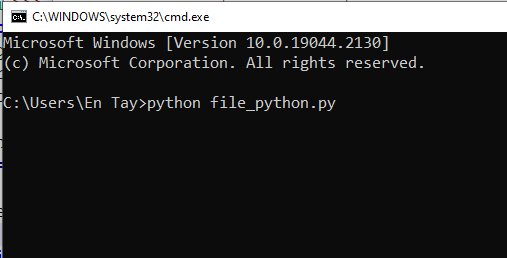

Untuk menjalankan Python ada banyak cara yang bisa dilakukan. Anda bisa menggunakan *shell*, terminal atau menggunakan _IDE_. Berikut beberapa cara menjalankan Python:

# Linux
1. Buka terminal <kbd>CTRL</kbd>+<kbd>ALT</kbd>+<kbd>T</kbd>
2. Ketik python maka Anda akan masuk ke Python shell. 
3. Tuliskan script Python Anda, contoh: `print("Selamat datang di Python")`. jika sudah tekan tombol <kbd>ENTER</kbd>, dan script Python akan dijalankan/eksekusi.
4. Untuk keluar dari Python shell ketik `exit()`

*atau*

1. Gunakan teks editor, misalnya gedit.
2. Buat file baru, dan ketikan script python Anda, contoh: `print("Selamat datang di Python")`.
3. Save As dengan ekstensi `.py` (contoh: `cetak.py`).
4. Jalankan file dengan menggunakan Terminal.
5. Buka terminal <kbd>CTRL</kbd>+<kbd>ALT</kbd>+<kbd>T</kbd>.
6. Masuk ke direktori dimana file Python Anda disimpan (contoh: `cd /Users/admin/Desktop/`).
7. Jalankan script Python dengan menggunakan python diikuti dengan nama file (contoh: `python cetak.py`).
8. Script Python Anda akan dieksekusi/dijalankan.

# Windows
**Menggunakan Shell**
1. Buka IDLE (python shell di windows), Anda bisa mencarinya di tombol <kbd>START</kbd>.
2. Tuliskan script Python Anda, contoh: `print("Selamat datang di Python")`. jika sudah tekan tombol <kbd>ENTER</kbd>, dan script Python akan dijalankan/eksekusi.


3. Untuk keluar dari Python shell ketik `exit()`

**Menggunakan Script Editor**
1. Untuk menjalankan script yang disimpan dalam file, buka IDLE (python shell di windows), Anda bisa mencarinya di tombol <kbd>START</kbd>.
2. Klik menu `File - New File`
3. Tulis script Python pada window yang muncul, contoh:

```python
print("Belajar Python")
print("di belajarpython.com")
```

4. Simpan script lewat menu `File - Save`
5. Jalankan program dengan klik menu `Run - Run Module`


**Menggunakan _Command Prompt_**
Dalam kenyataannya, Anda akan banyak menjalankan python lewat _command prompt_ atau _command line interface (CLI)_. Untuk menjalankan program python kita (contoh, file: _file_python.py_) kita menjalankannya lewat perintah `python file_python.py` di CLI.



Untuk bisa bekerja dengan lancar di CLI, ada baiknya Anda mempelajari perintah-perintah CLI terlebih dahulu.

# Mac OS
1. Buka terminal.
2. Ketik python maka Anda akan masuk ke Python shell. 
3. Tuliskan script Python Anda, contoh: `print("Selamat datang di Python")`. jika sudah tekan tombol <kbd>ENTER</kbd>, dan script Python akan dijalankan/eksekusi.
4. Untuk keluar dari Python shell ketik `exit()`

*atau*

1. Gunakan teks editor.
2. Buat file baru, dan ketikan script python Anda, contoh: `print("Selamat datang di Python")`.
3. Save As dengan ekstensi `.py` (contoh: `cetak.py`).
4. Jalankan file dengan menggunakan Terminal.
5. Buka terminal <kbd>CTRL</kbd>+<kbd>ALT</kbd>+<kbd>T</kbd>
6. Masuk ke direktori dimana file Python Anda disimpan (contoh: `cd /Users/admin/Desktop/`).
7. Jalankan script Python dengan menggunakan python diikuti dengan nama file (contoh: `python cetak.py`).
8. Script Python Anda akan dieksekusi/dijalankan.

# Online
Terkadang kita cuma butuh test beberapa perintah kode python secara cepat di komputer yang tidak terdapat program python. Untuk ini Anda bisa menggunakan layanan online. Berikut beberapa situs online yang Anda bisa gunakan:
* https://www.programiz.com/python-programming/online-compiler/
* https://www.online-python.com/
* https://sololearn.com/
* https://www.pythonanywhere.com/try-ipython/

# Android
Tersedia juga beberapa Python for Android yang Anda bisa download dari Play Store. Berikut beberapa aplikasi yang Anda bisa gunakan:
* [Pydroid 3 - IDE for Python 3](https://play.google.com/store/apps/details?id=ru.iiec.pydroid3)
* [QPython 3L - Python for Android](https://play.google.com/store/apps/details?id=org.qpython.qpy3)

# IDE (_Integrated Development Environment_)
_IDE_ adalah program yang didesain khusus untuk membantu proses menulisan kode program menjadi lebih efisien. Berikut beberapa pilihan _IDE_ yang bisa Anda gunakan untuk menulis kode program python.
* [Visual Studio Code](https://code.visualstudio.com/)
* [Notepad++](https://notepad-plus-plus.org/downloads/)
* [Sublime](https://www.sublimetext.com/)
* [PyCharm](https://www.jetbrains.com/pycharm/)
* [IDLE](https://docs.python.org/3/library/idle.html)
* ... [dan banyak lagi](https://en.wikipedia.org/wiki/List_of_Python_software#Integrated_Development_Environments_(IDEs)_for_Python).
**IDLE** adalah _IDE_ sederhana yang akan turut disertakan jika Anda melakukan instalasi python di Windows. Demi kesederhanaan proses belajar, kita akan menggunakan IDLE. Anda akan menemukan _IDLE_ ini di _Start Menu_ komputer Anda.
