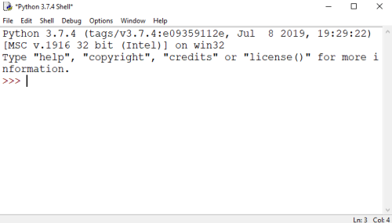
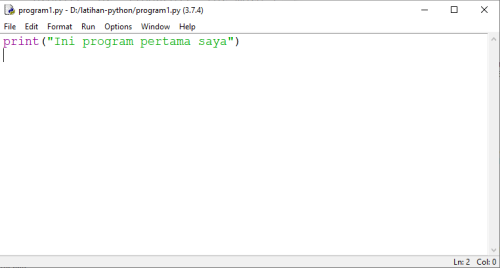

Sebelum melanjutkan belajar python, ada baiknya kita mengenal program yang akan kita gunakan untuk mengetikan kode program.
Jika Anda melakukan instalasi standar program python, maka Anda akan menemukan IDLE lewat _Start Menu_

# Shell


IDLE memiliki 2 bagian utama: 1. Shell; 2. Script Editor. Tampilan yang pertama kali muncul ketika IDLE dibuka adalah window _shell_. Pada window _shell_ kita bisa langsung mengetikan perintah dan meng-eksekusinya. Beberapa referensi menyebutkan fitur ini sebagai _interactive mode_. Jika di `>>>` kita mengetikan perintah python `print("Hello World")`, pada saat kita tekan _enter_ maka perintah tersebut akan langsung di eksekusi, dan di baris berikutnya akan muncul output hasil eksekusi perintah tersebut.
```python
>>> print("Hello World")
Hello World
```
Fitur _interactive mode_ ini tentu sangat berguna, karena terkadang kita perlu melakukan test beberapa perintah, tanpa perlu membuat program khusus. Tapi, tentu kalau mau membuat program yang terdiri dari banyak perintah, kita tidak bisa menuliskannya di _shell_. Untuk mengetikan kode program, kita akan menggunakan _script editor_.

**⌨ Latihan**
Coba Anda berekperimen mengetikan perintah-perintah berikut pada _shell_, dan perhatikan hasilnya.
```python
>>> print("Apa kabar!")

>>> 1 + 1

>>> 10 / 5 + 1

>>> print("1 + 1", 1 + 1)

```

# Script Editor
_Script editor_ disediakan untuk keperluan kita mengetian sekumpulan kode program. Untuk membuat file kode program python baru, klik menu _File - New_ pada menu _shell_


Pada _script editor_ kita bisa mengetikan beberapa baris program, mengeksekusinya sekaligus, menyimpannya untuk kemudian bisa dibuka kembali. Beberapa menu yang akan kita gunakan pada _script editor_:
- _File - New_ ➡ membuat file baru
- _File - Save_ ➡ menyimpan file
- _File - Save As_ ➡ menyimpan file dengan nama berbeda
- _Run - Run Module_ ➡ menjalankan program. Anda juga bisa menggunakan _shortcut F5_. Perlu diperhatikan bahwa jika Anda membuat file baru, sebelum menjalankan program, Anda perlu menyimpan kode program ke dalam file terlebih dahulu.

**⌨ Latihan**
- Buat program berikut pada _script editor_, kemudian eksekusi dan lihat hasilnya:
```python
print("Halo apa kabar?")
print("Senang bertemu denganmu")
print()
print("Salam Kenal")
```

