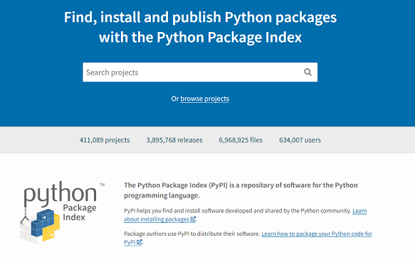
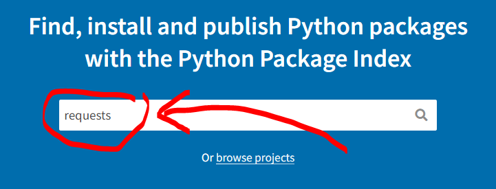
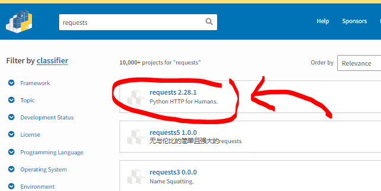
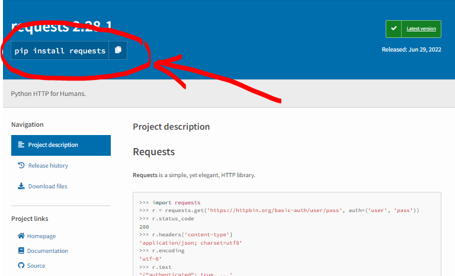
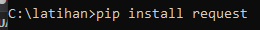

Python memiliki banyak module/package yang dikembangkan oleh banyak komunitas untuk berbagai keperluan. Banyak dari modul ini dibagikan secara gratis sehingga bisa digunakan secara gratis. Anda bisa menemukan modul-modul ini di [pypi.org](https://pypi.org).

# Mencari & Install
1. Tentukan kata kunci pencarian (contoh: _requests_)
   
2. Pilih modul pada daftar yang muncul
   
3. Di halaman modul Anda bisa menemukan instruksi instalasi (pada gambar: ditandai _lingkaran merah_), juga contoh program untuk keterangan bagaimana menggunakan modul.
   
4. Eksekusi instruksi instalasi pada _command prompt_
   
   

# Modul Populer Python
Ada beberapa modul/package populer yang Anda bisa coba:
1. **TENSORFLOW**\
   TensorFlow adalah platform end-to-end open-source untuk membuat aplikasi machine learning atau komputasi numerik cepat yang dibuat dan dirilis oleh Google. Library dasar ini dapat dipakai untuk membuat model deep learning secara langsung atau menggunakan library wrapper untuk menyederhanakan proses yang dibangun di atas TensorFlow.   
   Fitur utama TensorFlow meliputi bekerja secara efisien dengan ekspresi matematika yang melibatkan array multidimensi, dukungan yang baik dari jaringan saraf yang dalam dan konsep machine learning, hingga komputasi GPU/CPU di mana kode yang sama dapat dieksekusi pada kedua arsitektur.

2. **NUMPY**\
   NumPy (Numerical Python) adalah library python yang digunakan untuk bekerja dengan array dan juga memiliki fungsi yang bekerja dalam domain aljabar linier, transformasi fourier, dan matriks. Library yang dibuat pada 2005 oleh Travis Oliphant ini merupakan proyek open source sehingga Anda dapat menggunakannya secara bebas. Meski python memiliki daftar yang melayani tujuan array, prosesnya begitu lambat sehingga memerlukan NumPy yang bisa menyediakan objek array hingga 50 kali lebih cepat daripada daftar python tradisional.

3. **SCIPY**\
   SciPy (Scientific Python) adalah perpustakaan open-source yang digunakan untuk perhitungan ilmiah tingkat tinggi. Jenis library ini dibangun di atas ekstensi NumPy dan bekerja bersama untuk menangani komputasi yang kompleks. NumPy memungkinkan pengurutan dan pengindeksan data array, sementara kode data numerik disimpan di SciPy. Library python ini juga banyak digunakan oleh para developer dan engineer.

4. **PANDAS**\
   Pandas adalah perpustakaan penting bagi para data scientist. Library untuk machine learning yang bersifat open source ini menyediakan struktur data tingkat tinggi yang fleksibel serta berbagai alat analisis. Penggunaannya memudahkan analisis data, manipulasi data, dan pembersihan data. Pandas mendukung berbagai jenis operasi seperti penyortiran, pengindeksan ulang, iterasi, penggabungan, konversi data, visualisasi, agregasi, dan lain sebagainya.

5. **MATPLOTLIB**\
   Jenis library ini bertanggung jawab untuk merencanakan data numerik. Itulah alasan Matplotlib digunakan dalam analisis data. Library python yang bersifat open source ini dapat memplot angka-angka berdefinisi tinggi seperti diagram lingkaran, histogram, scatterplot, grafik, dan lain-lain.

6. **KERAS**\
   Keras adalah API deep learning yang ditulis dengan python dan berjalan di atas platform machine learning TensorFlow. Dengan lebih dari satu juta pengguna individu pada akhir tahun 2021, penggunaan Keras saat ini terbilang masif, baik di industri maupun komunitas penelitian. Bersama dengan TensorFlow, Keras lebih banyak dipakai daripada solusi deep learning lainnya dan sangat populer di kalangan startup yang menempatkan deep learning sebagai inti dari produk yang ditawarkan.
   Tanpa disadari, Anda pun terus berinteraksi dengan fitur yang dibuat dengan Keras (fitur yang salah satunya digunakan di Netflix). Keras & TensorFlow juga merupakan favorit di antara para peneliti, bahkan diadopsi oleh para peneliti di organisasi ilmiah besar, seperti CERN dan NASA.

7. **SCIKIT-LEARN**\
   Scikit-learn adalah library python terkenal yang digunakan untuk data kompleks. Perpustakaan open source ini mendukung machine learning dengan mendukung berbagai algoritma yang diawasi dan tidak diawasi seperti regresi linier, klasifikasi, pengelompokan, dan lain sebagainya. Library ini bekerja sama dengan Numpy dan SciPy.

8. **PYTORCH**\
   PyTorch adalah perpustakaan machine learning terbesar yang mengoptimalkan komputasi tensor. Ia memiliki API yang kaya untuk melakukan komputasi tensor dengan akselerasi GPU kuat, membuatnya mampu membantu memecahkan masalah aplikasi yang terkait dengan jaringan saraf.
   Perpustakaan tensor yang dioptimalkan ini utamanya digunakan untuk aplikasi deep learning menggunakan GPU dan CPU. Library phyton yang sebagian besar dikembangkan oleh tim Riset AI Facebook ini merupakan salah satu yang paling banyak digunakan di samping TensorFlow dan Keras.

9. **BeautifulSoup**\
    Beautiful Soup adalah library terbaik untuk menarik data dari file HTML dan XML. Bisa digunakan bersama dengan parser favorit kita. 
    Library ini juga bagus untuk program scrapping web. Jika kita memiliki halaman web statis sederhana di mana Anda perlu menemukan sedikit informasi yang ada di dalam file HTML, maka library ini sangat bisa diandalkan. 
    Dokumentasi BeautifulSoup: https://www.crummy.com/software/BeautifulSoup/bs4/doc/

10. **SCRAPY**\
    Sebuah _web scrapping framework_ yang digunakan untuk mengekstraksi data dari website. Mirip dengan _BeautifulSoup_ hanya saja _scrapy_ menyediakan fitur _web crawling_
    Dokumentasi Scrapy: https://docs.scrapy.org/en/latest/

11. **PyAutoGUI**
    Library ini memungkinkan script Python kita mengontrol mouse dan keyboard untuk mengotomatiskan interaksi dengan aplikasi lain.
    PyAutoGUI bisa dijalankan pada OS Windows, macOS, dan Linux. Juga kompatibel dengan Python 2 & 3.
    Beberapa fitur yang dimiliki library PyAutoGUI ini adalah:
    - Memindahkan mouse dan mengklik atau mengetik di dalam jendela aplikasi lain.
    - Mengirim penekanan tombol ke aplikasi.
    - Mengambil  tangkapan layar, memberikan gambar, dan menemukan sesuatu di layar. 
    Dokumentasi PyAutoGUI: https://pyautogui.readthedocs.io/en/latest

12. **Selenium**\
    Salah satu modul paling populer yang digunakan dalam Python untuk melakukan pengujian dan terhubung ke berbagai browser adalah Selenium.
    Library ini digunakan untuk mengotomatisasi interaksi browser web dari Python.
    Dokumentasi Selenium: https://selenium-python.readthedocs.io/

13. **Pygame**\
    Framework yang digunakan untuk membuat animasi grafik, bisa juga digunakan untuk membuat game sederhana. Pembuatan game menggunakan pygame lebih ditujukan untuk tujuan pembelajaran, bukan untuk pembuatan game secara profesional.
    Dokumentasi Pygame: https://www.pygame.org/docs/

14. **requests**\
    _requests_ adalah modul yang hampir pasti Anda gunakan jika Anda mau melakukan _API call_ atau _download_ data atau halaman web menggunakan protokol HTTP.
    Dokumentasi requests: https://requests.readthedocs.io/en/latest/

15. **PyQt**\
    Framework yang digunakan untuk membuat GUI dengan Python. Mirip dengan Tkinter, namun kelebihan yang dimiliki PyQt adalah ia memiliki program _form designer_, dimana kita bisa membuat form GUI untuk Qt dengan cara _drag & drop_.

16. **Pillow**\
    Modul untuk melakukan pengolahan gambar seperti: _rotate_, _scaling_, set _brightness & contrast_, _cropping_, dll.
    Dokumentasi Pillow: https://pillow.readthedocs.io/en/stable/

17. **OpenCV**\
    Modul ini menyediakan banyak algoritma _computer vision_. Beberapa bagian penting dalam _computer vision_ adalah:
    - Pengolahan gambar
    - Video analisis
    - Kalibrasi kamera
    - Pengenalan objek
    - Video capture
    Dokumentasi OpenCV: https://docs.opencv.org/4.x/d6/d00/tutorial_py_root.html

18. **Flask**\
    Framework python yang digunakan untuk membuat website.    

Berikut beberapa modul lain yang cukup menarik untuk dicoba.
1. **pyttsx3**\
   Modul _text-to-speech_, mengubah text menjadi suara. pyttsx3 menggunakan fitur Voice Windows (jika menggunakan Microsoft Windows). Untuk bahasa selain bahasa inggris, install language pack di Windows.
   Dokumentasi pyttsx3: https://pypi.org/project/pyttsx3/

2. **openpyxl**\
   Modul untuk membaca dan menulis ke file Excel.
   Dokumentasi openpyxl: https://openpyxl.readthedocs.io/en/stable/

3. **yfinance**\
   Salah satu modul untuk mengakses data dari Yahoo! Finance.
   Dokumentasi yfinance: https://pypi.org/project/yfinance/

4. **indodax**\
   Modul membantu melakukan _API call_ untuk membaca data atau melakukan transaksi di platform jual beli crypto Indodax.
   Dokumentasi indodax: https://pypi.org/project/indodax/

5. **wikipedia**\
   Modul untuk download atau mencari artikel di wikipedia.
   Dokumentasi wikipedia: https://pypi.org/project/wikipedia/