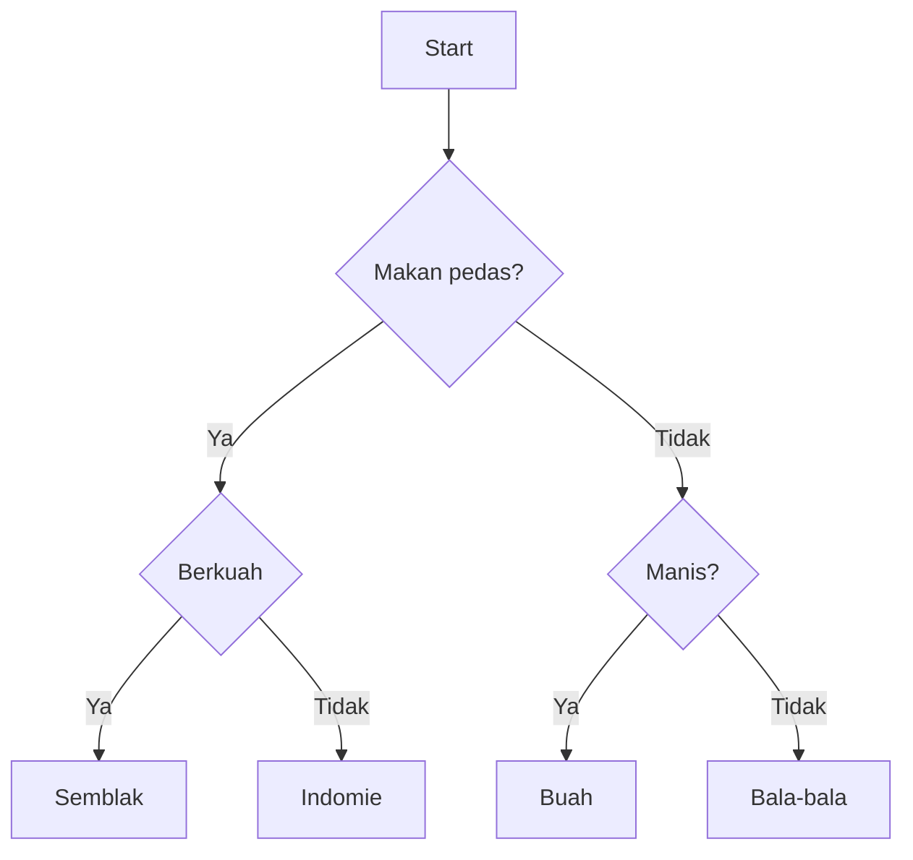

## Latihan Program 1

Buat program menggunakan python yang mensimulasikan _memilih makanan_. Proses pemilihan makanan mengikuti diagram seperti berikut:



contoh hasil 1:
```
Makan pedas?y
Berkuah?y
Makanan = Semblak
```

contoh hasil 2:
```
Makan pedas?t
Manis?y
Makanan = Buah
```