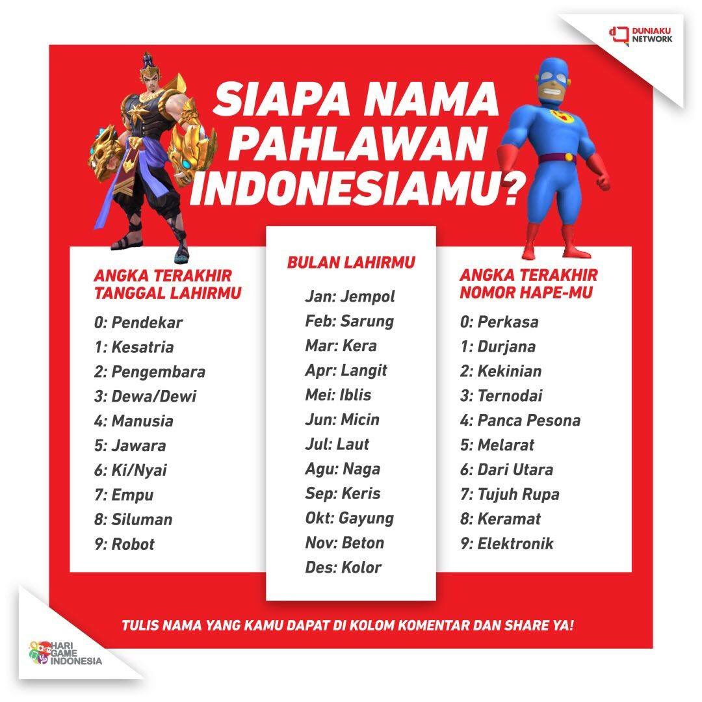

## Siapa nama pahlawan Indonesiamu?




### Latihan 1
Buat program yang menanyakan _angka terakhir tanggal lahir_, _bulan lahir_, dan _angka terakhir nomor HP_, kemudian tampilkan _nama pahlawan_ berdasarkan ketentuan gambar diatas.

contoh:
```
Angka terakhir tanggal lahirmu? 1
Bulan lahirmu? 5
Angka terakhir nomor HP mu? 4

WWWuuuuuzzzz....!!!
Namamu adalah KESATRIA IBLIS PANCA PESONA
```
### Latihan 2
Buat program yang sama, tapi yang ditanyakan adalah _tanggal lahir_, _bulan lahir_ dan _nomor HP_.

contoh:
```
Tanggal lahirmu? 15
Bulan lahirmu? 2
nomor HP mu? 081223847323

WWWuuuuuzzzz....!!!
Namamu adalah JAWARA SARUNG TERNODAI
```