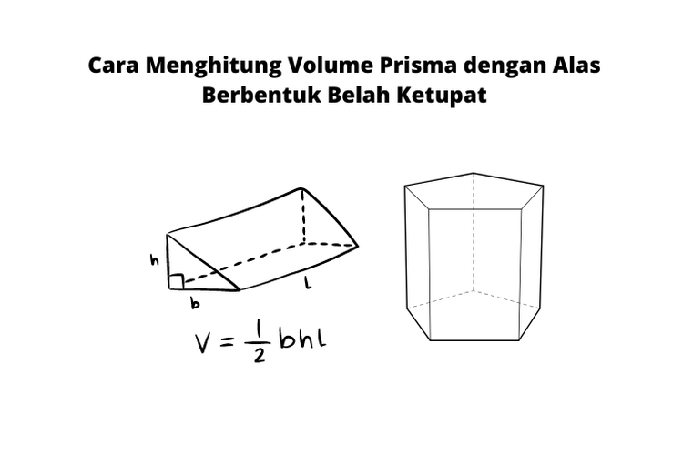

# Soal 4

Diketahui rumus menghitung luas dan kelilig sebuah trapesium adalah sebagai berikutt:



Buat program yang meminta input `b`, `h`, `l`. Program kemudian menghitung volumenya (`V`)

**Contoh 1:**
```
h? 3
b? 4
l? 5
V= 30.0
```

**Contoh 1:**
```
h? 4
b? 5
l? 7
V= 70.0
```